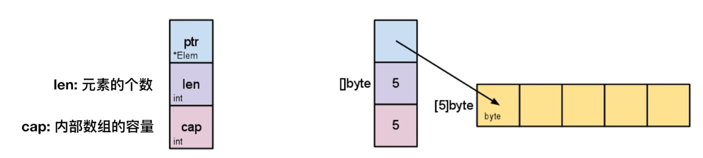
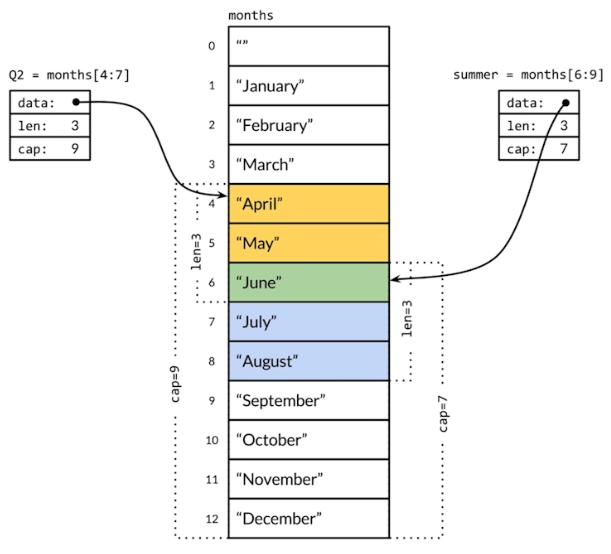

## 数组

### 1. 数组声明
```go
var a [3]int                    // 声明并初始化默认值0
b := [3]int{1,2,3}              // 声明并初始化
c := [...]int{1,2,3,4}          // 按个数决定数组长度
d := [2][2]int{{1,2}, {3,4}}    // 多维数组声明并初始化
```

### 2. 数组遍历
```go
// 不推荐
a := [...]int{1,2,3,4}
for i := 0; i < len(a); i++ {
    t.Log(a[i])
}

// 推荐写法
for index,value := range a {
    t.Log(index, value)
}
```

### 3. 数组截取
a[开始索引（包含）:结束索引（不包含）]
```go
a := [...]{1,2,3,4,5}
a[1:2]  // 2
a[1:3]  // 2,3
a[1:len(a)] // 2,3,4,5
a[1:]   // 2,3,4,5
a[:3]   // 1,2,3
a[:]    // 1,2,3,4,5
// a[-1:]   // 不支持
// a[:-1]   // 不支持
```

## 切片

### 1. 内部结构



### 2. 切片声明
```go
var a []int             // 没有长度，因为是可变长的
a = append(a, 1)
b := []int{1,2,3}       // 声明并初始化
c := make([]int,3,5)    // []type,len,cap len(c)=3,cap(c)=5,len个元素初始化为0，未初始化元素不可访问
d := arr[3:6]           // 数组arr的切片
```

> 为什么 append 要重新赋值？

### 3. 切片共享存储结构



> append会发生重新申请和拷贝，连续存储空间地址会发生变化

- 多个切片指向同一个数组时，修改其中一个，其他切片也会受影响

## 比较

1. 数组容量不可伸缩，切片容量可伸缩

2. 数组可以比较，长度相同且值相等则相同；切片只能和`nil`比较
```go
a := []int{1,2,3,4}
b := []int{1,2,3,4}
if a == b {     // 会报错
}
```
