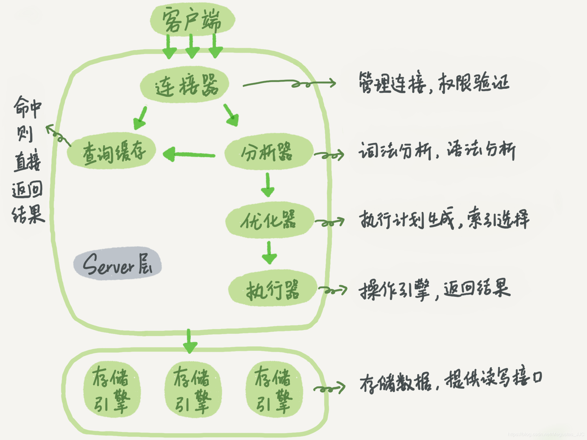

### 基本架构图



- 存储层
  - 负责数据的存储和提取
  - 插件式 架构，支持多个存储引擎
- server 层
  - `MySQL` 的大多数核心服务功能
  - 所有的内置函数（如日期、时间、数学和加密函数等）
  - 所有跨存储引擎的功能

### 连接器
- 负责跟客户端建立连接、获取权限、维持和管理连接。
- 权限依赖于连接成功时读到的权限
>（*即：即使管理员修改了用户权限，也不影响已经存在连接的权限*）
- 连接完成后，可以在 `show processlist` 命令中看到它
- 如果太长时间没动静，连接器就会自动断开连接，由 `wait_timeout` 控制自动断开连接时间，默认8小时
- `MySQL` 在执行过程中临时使用的内存是管理在`连接对象`里面的，这些资源会在连接断开时才释放。若长连接累计下来可能会导致内存占用太大，被系统强行杀掉（OOM）。
>（*从现象看就是 MySQL 异常重启了*）

>*如何解决？*  
>>*1. 定期断开长连接，要查询再重连*  
*2. MySQL 5.7 或更新版本，通过执行 `mysql_reset_connection` 来重新初始化连接资源。这个过程不需要重连和重新做权限验证，但是会将连接恢复到刚刚创建完时的状态。*

### 查询缓存
- 执行过的语句及其结果可能会以 `key-value` 对的形式，被直接缓存在内存中。如果查询能够在缓存直接找到 `key`，那么 `value` 会直接返回客户端
- 只要有对一个表的更新，这个表上所有的查询缓存都会被清空  
（*对于更新压力大的数据库来说，查询缓存的命中率会非常低*）
- 设置参数 `query_cache_type` 为 `DEMAND`，不使用查询缓存
- 对于确定要使用查询缓存的语句，可以用 SQL_CACHE 显式指定
```
mysql> select SQL_CACHE * from T where ID=10；
```
- **MySQL 8.0 版本直接将查询缓存的整块功能删掉了**

### 分析器
- 词法分析->语法分析->语义分析
- 一般语法错误会提示第一个出现错误的位置，所以要关注的是紧接“use near”的内容。

### 优化器
- 有多个索引的时候，决定使用哪个索引
- 有多表关联 `join` 的时候，决定各个表的连接顺序

### 执行器
- 检查执行权限
- 根据表的引擎定义，去使用这个引擎提供的接口。
- 慢查询日志中有一个 `rows_examined` 的字段，表示这个语句执行过程中扫描了多少行。这个值是在执行器每次调用引擎获取数据行的时候累加的。