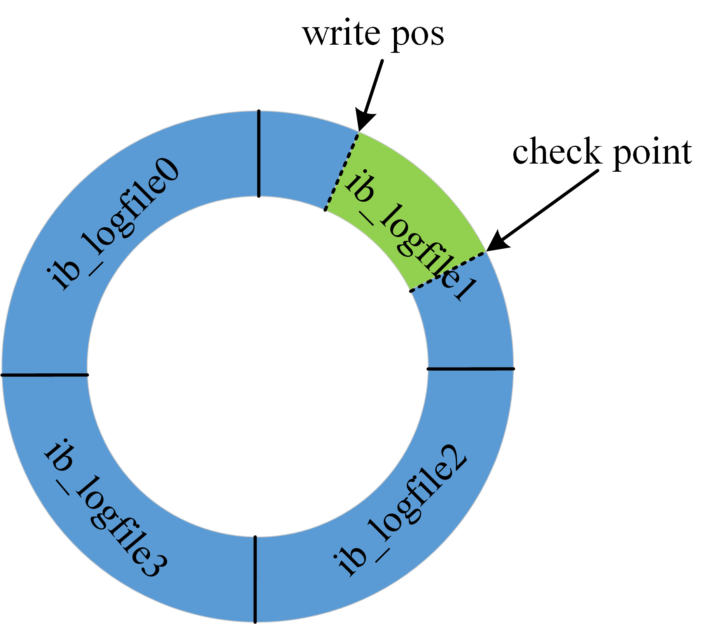

- [github](https://github.com/linyaolong/my_docs/blob/master/MySQL/02%20%E4%B8%80%E6%9D%A1SQL%E6%9B%B4%E6%96%B0%E8%AF%AD%E5%8F%A5%E6%98%AF%E5%A6%82%E4%BD%95%E6%89%A7%E8%A1%8C%E7%9A%84.md)

假设有一张表：
```
create table T(ID int primary key, c int);
```
执行更新语句：
```
mysql> update T set c=c+1 where ID=2;
```
执行流程：
> 1. 通过连接器，客户端与 MySQL 建立连接
> 2. `update` 语句会清空 `T` 表上的所有查询缓存
> 3. 分析器通过词法和语法解析知道这是一条更新语句
> 4. 优化器决定使用 `ID` 这个索引
> 5. 执行器找到这一行，执行更新
> 6. 更新过程中涉及 `redo log` 和 `inlog` 的操作  
> (*这两种日志默认在数据库的 data 目录下，`redo log` 是 ib_logfile0 格式的，`binlog` 是 xxx-bin.000001 格式*)

### redo log
> **通常是物理日志，记录的是数据页的物理修改，而不是某一行或某几行修改成怎样怎样，它用来恢复提交后的物理数据页(恢复数据页，且只能恢复到最后一次提交的位置)。**
- 问题  
若每次更新都直接写磁盘，则需要先从磁盘找到记录，再更新，整个过程IO成本、查找成本都很高
- 解决  
采用 `WAL` (`Write-Ahead Logging`) 技术，**先写日志，再写磁盘**
- 流程
> 1. 当有一条记录要更新时，`InnoDB` 引擎会先把记录写到`redo log`（`redolog buffer`）里面，并更新内存（`buffer pool`）  
> (***此时读数据是否出现脏读？***)
> 2. `InnoDB` 引擎会在适当的时候（*如系统空闲时*），将这个操作记录更新到磁盘里面（刷脏页）
> 3. `redo log` 是固定大小的，比如可以配置为一组4个文件。每个文件的大小为1GB，那么这个 `redo log` 日志文件的总共可以记录4GB的文件。  

> 4. 如果 `write pos` 追上 `check point` ,表示 `redo log` 已经满了，暂停 `redo log` 日志的写入，将部分记录更新到磁盘中，腾出空间为新记录，`check point` 推进。
> 5. 在数据库进行异常重启的时候，可以根据 `redo log` 日志进行恢复，达到 **`crash-safe`**
> 6. `innodb_flush_log_at_trx_commit` 这个参数设置成 `1` 表示每次事务的 `redo log` 都直接持久化到磁盘，可以保证 MySQL 异常重启之后数据不丢失。

### binlog
> 逻辑日志，是以二进制的形式记录的是这个语句的原始逻辑，(*比如“给 ID=2 这一行的 c 字段加 1 ”。*)依靠 `binlog` 是没有 `crash-safe` 能力的
- 有两种模式，`statement` 格式的话是记 `sql` 语句，`row` 格式会记录行的内容，记两条，更新前和更新后都有。
- `sync_binlog` 这个参数设置成 `1` 的时候，表示每次事务的 binlog 都持久化到磁盘。可以保证 `MySQL` 异常重启之后 `binlog` 不丢失。

 **update 语句的执行流程图**  
 
 > 图中浅色框表示是在 `InnoDB` 内部执行，深色框表示是在执行器中执行
 
 - 两阶段提交  
`redo log` 和 `binlog`  都可以用于表示事务的提交状态，而两阶段提交就是让这两个状态保持逻辑上的一致。
> *原理：*
> 1. `InnoDB` `redo log` 写盘，`InnoDB` 事务进入 `prepare` 状态
> 2. `binlog` 写盘，`InnoDB` 事务则进入 `commit` 状态(在 `redo log` 里面写一个 `commit` 记录)